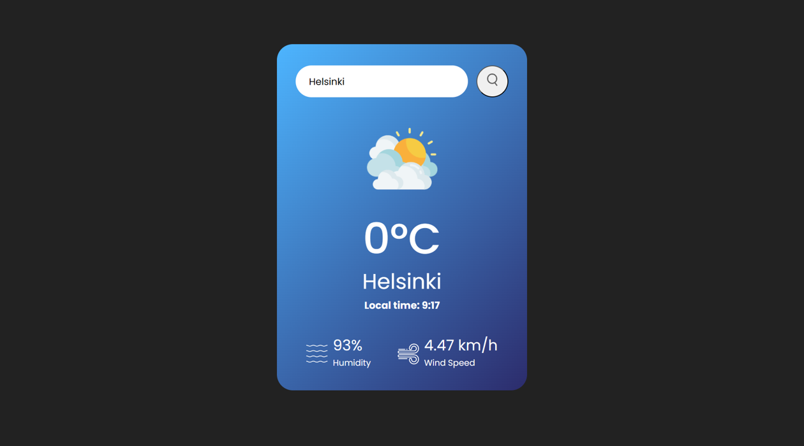

# Weather-app

This is a web application that allows users to check the current weather information for any city, country or area in the world.

## Features

It fetches real-time weather data, including temperature, humidity, wind speed, and weather icons, local time, and presents it in a user-friendly interface.

[Live Demo](https://kudoo39.github.io/Weather-app/)

## Technologies Used

- JavaScript
- HTML
- CSS

